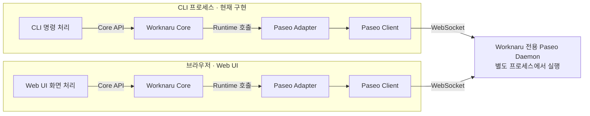

# Worknaru 개념 아키텍처

Worknaru는 누구나 자신의 업무를 AI 기반 Module로 만들고, 그것들을 하나의 Workspace에서 조합·실행할 수 있게 하는 플랫폼이다. 사용자가 플랫폼 안에서 AI Agent와 함께 Module을 개발하는 것이 핵심 목표다.

이 문서는 현재 코드의 구성요소와 실행 구조를 설명한다. CLI와 Web UI는 같은 Core와 Paseo Adapter를 사용해 전용 Daemon의 상태를 확인한다. 웹 앱은 브라우저 안에서 실행하며, 현재 제품 기능은 일회성 상태 조회에 한정한다.

제품 호출·로컬 개발 환경 관리·CLI와 브라우저 실행 구조의 현재 결정은 [ADR 0005](adr/0005-local-development-cli-boundary.md)에 둔다. 이전 결정의 본문은 ADR 0001·0003에 보존한다. 작업 범위와 검증 증거는 관련 GitHub Issue에서 관리한다.

## 제품 개념과 현재 구현의 관계

| 개념 | 플랫폼에서의 의미 |
| --- | --- |
| Module | 하나의 업무 기능. 외부 서비스, 로컬 서비스, AI Agent의 참여와 사용자의 검수·수정을 함께 구성할 수 있다. |
| Workspace | 사용자가 자신의 업무에 필요한 Module들을 모아 조합하고 실행하는 공간이다. |
| AI Agent | 사용자와 함께 Module 개발을 돕거나, Module이 실행되는 과정에 참여하는 역할이다. 두 역할은 필요로 하는 맥락과 권한이 다를 수 있다. |

예를 들어 문서 정규화 Module은 업로드된 형식에 따라 변환 서비스를 선택하고, 변환 결과를 사람이 검수·수정한 뒤 일관된 최종 문서를 만들 수 있다. 이는 플랫폼이 지원하려는 업무의 예시다.

현재 코드가 제공하는 것은 이 제품을 만들기 위한 실행 기반의 연결과 상태 조회다. Module 정의·개발·실행, Worknaru Workspace 관리와 Agent 세션의 생성·재사용은 아직 제품 API로 구현하지 않았다. Worknaru Workspace와 Paseo Workspace의 대응 관계도 후속 설계 대상이다.

## 구성과 연결

아래는 CLI와 Web UI의 상태 조회 구조다. 두 앱은 같은 라이브러리 코드를 사용하고, 각각의 실행 환경 안에서 Core·Adapter·Paseo Client 인스턴스를 만든다.

화살표는 호출·통신 흐름이다. **Runtime은 Core와 Adapter 사이의 계약이다. 별도 서버나 추가 실행 단계가 아니다.** Core가 주입받은 Runtime의 메서드를 호출하면 현재 구성에서는 Paseo Adapter의 구현이 실행된다.

Core API는 앱 안에서 호출하는 TypeScript 라이브러리 API다. CLI에서는 CLI 프로세스 안에서, Web UI에서는 브라우저 안에서 실행한다. Paseo Client도 Adapter가 사용하는 라이브러리이며 같은 환경 안에서 동작한다. 실제 통신 대상인 Paseo Daemon은 별도 프로세스로 실행된다.

여기서 공유하는 것은 Core·Runtime·Adapter의 코드와 계약이다. CLI와 Web UI가 하나의 Core 인스턴스나 메모리를 함께 쓰는 것은 아니다. 각 앱은 자신의 연결을 만들고 같은 Daemon을 대상으로 동작할 수 있다. Module·Workspace 데이터를 앱 사이에서 공유할 저장 구조는 후속 설계 대상이다.

## 구성요소의 책임

| 구성요소 | 책임과 구현 범위 | 코드·사용 안내 |
| --- | --- | --- |
| CLI | 명령·옵션·환경 변수 해석, 로컬 개발 환경 진단·시작·종료, Core 상태 조회, 텍스트·JSON 출력 | [apps/cli](../apps/cli/README.md) |
| Web UI | 상태 확인 버튼·결과 표시, 개발용 접속 설정 전달과 Core API 호출 | [apps/web](../apps/web/README.md) |
| Dev environment | 개발 실행기들이 공유하는 경로·설정·Paseo 프로세스·공개 웹 파일 준비. Node 전용 | [packages/dev-environment](../packages/dev-environment/README.md) |
| Branding | 빌드 시 검증·고정한 제품 표시 이름·정적 자산·색상·링크를 앱에 제공 | [packages/branding](../packages/branding/README.md) |
| Core | 앱이 호출할 Worknaru API 제공. 현재 `getDaemonStatus()`를 주입된 Runtime으로 전달 | [packages/core](../packages/core/README.md) |
| Runtime | 실행 기반에 요청할 기능과 Worknaru가 이해할 결과·오류 타입 정의 | [packages/runtime](../packages/runtime/README.md) |
| Paseo Adapter | 지정한 Daemon에 접속해 식별자·버전·상태를 확인하고, SDK 응답·오류를 Runtime 계약으로 변환 | [packages/paseo-adapter](../packages/paseo-adapter/README.md) |
| Paseo Client | Adapter 내부에서 사용하는 Paseo SDK. Daemon 연결과 메시지 송수신 처리 | [Paseo SDK 안내](https://paseo.sh/docs/sdk.md) |
| Paseo Daemon | 접속을 받아 상태를 제공하는 실행 서비스. Paseo가 가진 Agent 실행·세션 관리 기능은 이후 필요한 범위에서 연결 | [전용 개발 환경](../apps/paseo-dev/README.md) |

Core는 구체적인 Paseo SDK, CLI 출력 형식이나 웹 화면을 알지 못한다. 현재 Core는 상태 조회를 전달하는 얇은 API다. Module·Workspace의 업무 정책과 관계를 담당할 경계는 Core에 두며, 해당 업무 로직은 별도 구현 범위로 남아 있다.

Paseo SDK 호출, SDK 고유의 응답·예외 처리와 버전별 대응은 제품 코드에서 Adapter 내부에 모은다. 다른 실행 기반을 도입할 때도 Core가 사용하는 Runtime 계약을 기준으로 연결할 수 있다.

## 앱 시작과 기능 호출

앱의 표시 계층은 [공통 브랜드 패키지](../packages/branding/README.md)가 빌드 시 생성한 이름·자산·색상·링크를 사용한다. Core·Runtime·Adapter는 브랜드에 의존하지 않는다. 저장 위치는 개발 실행기의 [공통 경로 해석](../packages/dev-environment/paths.mjs)이 시작 시 결정하며, 브랜드에서 데이터 경로·서버 ID를 유도하지 않는다. 근거는 [ADR 0004](adr/0004-build-time-branding-and-data-root.md)에 둔다.

초기 입력 계약은 표시 이름의 한글·일반 공백을 허용하되 이미지 파일명은 고정하고 링크 입력은 ASCII로 제한한다. 데이터 루트의 폴더명은 영문·숫자·`-_.`만 받으며 기본 경로도 검증한다. 상세 규칙과 대체 루트 안내는 [저장 위치 설정](../apps/paseo-dev/README.md#저장-위치-설정)을 따른다. 이 검증은 표시·개발 실행 계층이 맡으며 외부 프로젝트나 사용자 홈 전체의 경로 호환성을 보장하지 않는다.

[CLI 시작 코드](../apps/cli/src/bootstrap.ts)는 설정으로 Paseo Adapter를 만들고, 그 Runtime을 Core에 주입한다. 이 단계에서 사용할 구현을 선택한다.

제품 조회의 [명령 처리 코드](../apps/cli/src/cli.ts)는 Core API만 호출한다. 시작 코드가 Adapter의 생성 함수를 가져오는 것과 명령이 실행 기반의 기능을 직접 호출하는 것은 역할이 다르다. 실제 Daemon 작업은 Core와 Runtime 계약을 거쳐 Adapter가 수행한다.

CLI는 사람과 AI Agent가 사용한다. 사람에게는 `doctor`, `dev start`, `status`, `dev stop`의 기본 개발 흐름을 제공하고, 자동화는 명시적 대상과 JSON 계약을 사용할 수 있다. CLI를 호출하는 Agent와 Daemon이 관리하는 Agent 세션은 서로 다른 개념이다. 현재 상태 조회 명령은 호출자를 위한 새 Agent 세션을 만들지 않는다.

Web UI의 [시작 코드](../apps/web/src/bootstrap.ts)도 Adapter를 생성하고 Core에 주입한다. [화면 코드](../apps/web/src/main.ts)는 Core API를 호출하고 Worknaru의 결과·오류를 표시한다. 개발 실행 프로그램이 확인한 대상 ID·예상 서버 ID를 `connection.json`으로 전달하고, 브라우저는 페이지와 같은 호스트의 `/ws`로 접속한다. CLI의 환경 변수를 브라우저에서 직접 읽지 않는다. 현재 웹 앱에는 인증 입력·대상 선택·설정 저장 UI가 없다.

Web UI의 HTML·JavaScript 같은 정적 파일은 Paseo Daemon 자체가 브라우저에 제공할 수 있다. 별도 정적 호스팅을 사용할 수도 있으며, 파일을 제공하는 위치와 Core·Adapter가 실행되는 위치는 구분한다. 어느 경우든 전달된 코드의 Core 호출과 Daemon 통신은 브라우저 안에서 수행하므로 이 경로에 별도 Worknaru API 서버를 필수 구성요소로 두지 않는다.

현재 `pnpm exec worknaru dev start`는 Web UI·Core·Adapter·Paseo Client를 포함한 브라우저용 빌드 결과물을 `apps/web/dist`에 만들고, 공개 자산만 별도 임시 디렉터리에 복사해 전용 Paseo Daemon이 제공하도록 실행한다. 브라우저는 Daemon에서 파일을 받아 실행한 뒤, 그 안의 Client로 같은 Daemon에 WebSocket 연결을 맺는다. 현재 고정한 Paseo 버전은 웹 UI를 활성화한 상태에서 `PASEO_WEB_UI_DIST_DIR` 또는 `features.webUi.distDir`로 제공할 디렉터리를 지정할 수 있다. 개발 명령은 자식 환경에만 전자를 전달해 기존 Daemon 설정 파일을 보존한다. [Daemon 웹 UI 제공 안내](https://paseo.sh/docs/web-ui.md), [디렉터리 설정 소스](https://github.com/getpaseo/paseo/blob/7bcf167862ce9bb040007d1469c77c00928a84c8/packages/server/src/server/config.ts)

정적 파일 제공과 접속 설정 전달은 별개의 책임이다. 현재는 같은 PC의 loopback 주소에서 개발용 화면을 제공한다. 원격 접속·인증과 실제 제품의 호스팅 구성은 후속 배포 설계에서 정한다.

## 상태 조회 한 번의 흐름

현재 제품 명령은 `worknaru status`다. 동작 순서는 다음과 같다.

1. 연결 옵션·환경 변수가 하나라도 있으면 명시적 주소와 예상 서버 ID를 모두 요구한다. 없으면 현재 데이터 루트의 관리 실행기·서버 ID·PID 기록을 확인하고 해당 대상을 선택한다. 불완전한 명시적 설정은 기본 대상으로 보충하지 않는다.
2. 시작 코드가 Adapter와 Core를 구성하고, 명령 처리 코드가 `Core.getDaemonStatus()`를 호출한다.
3. Core는 주입된 `Runtime.getDaemonStatus()`를 호출한다.
4. Adapter가 조회용 클라이언트로 접속하고 서버 ID와 버전을 확인한다. 확인을 통과하면 Daemon 상태를 요청한다.
5. Adapter가 응답이나 실패를 Worknaru의 `DaemonStatus`로 변환하고 자신의 클라이언트 연결을 정리한다.
6. CLI가 Core에서 받은 결과를 출력하고 종료 코드를 반환한다. 상태가 확인되면 `0`, 조회 불가이면 `1`이다. 입력·설정 오류와 예상하지 못한 오류는 별도로 구분한다.

기본 로컬 조회는 개발 환경 상태와 Core 결과를 별도 `daemon` 필드에 담고, 기존 명시적 조회는 DaemonStatus JSON을 그대로 반환한다. 제품 조회 결과에는 대상, 확인 시각, 연결 상태, 확인된 서버 정보와 실패 이유가 담긴다. 연결 상태는 조회 당시의 관찰값이다. 접속 실패만으로 원격 운영체제의 프로세스가 종료되었다고 판단하지 않으므로, 로컬 프로세스 상태는 `unknown`으로 표현한다.

조회는 Daemon이나 Agent를 시작·중단·보관하지 않는다. 명령이 끝날 때 정리하는 것은 조회용 연결이다. 명령 문법·인증 전달·출력 형식·종료 코드의 상세 정의는 [CLI 사용 안내](../apps/cli/README.md), 결과 타입의 의미는 [Runtime 계약](../packages/runtime/README.md)을 따른다.

Web UI의 첫 상태 조회도 같은 Core API와 Runtime 결과를 사용한다. 입력과 결과 표현을 웹 화면이 맡고, 대상 확인·상태 조회·오류 변환·조회용 연결 정리는 공통 Adapter가 맡는다. 지속 연결, 이벤트 구독과 재접속 정책은 현재의 일회성 상태 조회와 별도로 설계한다.

## 브라우저 호환 범위

브라우저 호환은 Core·Adapter의 공통 코드를 CLI의 Node.js 환경과 브라우저 양쪽에서 실행할 수 있도록 조정하고 검증하는 작업이다. 웹 화면을 만드는 작업과 구분한다.

Paseo Client는 환경에 맞는 WebSocket 연결 구현을 전달받을 수 있다. Paseo의 [CLI 연결 코드](https://github.com/getpaseo/paseo/blob/7bcf167862ce9bb040007d1469c77c00928a84c8/packages/cli/src/utils/client.ts)는 Node.js용 `ws`를 제공하고, [웹 연결 코드](https://github.com/getpaseo/paseo/blob/7bcf167862ce9bb040007d1469c77c00928a84c8/packages/app/src/runtime/websocket-factory.web.ts)는 브라우저 WebSocket을 사용하는 Client 기본 기능을 선택한다. Worknaru는 이 Client를 Adapter 안에서 재사용한다.

Core·Runtime의 책임과 상태 조회 계약을 유지하면서 다음과 같이 브라우저 실행을 지원한다.

| 부분 | 현재 적용 내용 |
| --- | --- |
| Adapter | 연결 ID는 공통 Web Crypto로 생성하고 표준 WebSocket으로 접속한다. 앱 시작 코드가 `clientType`을 `'cli'` 또는 `'browser'`로 전달한다. |
| 의존 패키지와 빌드 | 버전에 한정한 pnpm 패치로 Paseo relay의 브라우저 파일 경로를 조정한다. 웹 빌드는 Core·Adapter·Client를 함께 포함한다. 세부 사항은 [Adapter 안내](../packages/paseo-adapter/README.md)를 따른다. |
| 검증 경계 | Windows의 브라우저에서 전용 Daemon의 정상 조회·종료 후 실패를 확인한다. 인증 오류·대상 불일치·시간 초과는 loopback 응답 서버로 검증한다. 기존 CLI 동작은 공통 테스트와 전용 Daemon 검증으로 확인한다. |

검증한 범위는 현재 상태 조회 기능이다. 다른 브라우저·원격 배포·로그인·지속 연결의 호환성을 포괄적으로 보장하는 것은 아니다. 설계 조사 근거는 [아키텍처 작업 #7](https://github.com/NaruForge/worknaru-dev/issues/7), 최초 구현과 실제 실행 검증은 [웹 상태 조회 #9](https://github.com/NaruForge/worknaru-dev/issues/9), Paseo 정식 버전 전환 후 재검증은 [0.8.0 전환 #11](https://github.com/NaruForge/worknaru-dev/issues/11)에 연결한다.

## 실행 환경과 데이터 경계

Worknaru 전용 Paseo는 현재 PC의 개인용 Paseo와 실행 인스턴스, Daemon 데이터 디렉터리와 접속 주소를 분리한다. Adapter는 지정한 대상의 서버 ID를 확인하며, 접속에 실패해도 다른 Paseo로 대체 접속하지 않는다.

같은 Windows 사용자 홈, 파일 접근 권한과 기존 Provider 인증 환경은 함께 사용할 수 있다. 분리의 목적은 두 Daemon의 운영 충돌을 방지하는 것이다.

| 위치·수명 | 현재 보관하는 것 |
| --- | --- |
| Git 저장소 | 소스, 문서, 패키지 의존성과 개발 환경 재현 절차 |
| CLI 프로세스 | 호출에 전달된 설정과 조회 중인 클라이언트·결과. Core와 Adapter에 별도 업무 상태 저장소는 없음 |
| 브라우저 | 내려받은 웹 코드·대상 설정과 조회 중인 클라이언트·화면 결과. 업무 데이터 저장·동기화 기능은 없음 |
| 전용 Daemon 데이터 디렉터리 | Daemon 식별 정보·설정·로그·worktree·임시 파일과 CLI 관리 실행 기록·잠금. `WORKNARU_DATA_DIR`로 지정하고 기본값은 Git 추적에서 제외된 `.local/paseo-dev/` |
| 임시 웹 제공 디렉터리 | 데이터 루트의 `tmp/web-*`. 공개 빌드 자산과 실행용 `connection.json`만 제공하고 해당 실행 종료 시 정리 |
| 기존 사용자 환경 | 공유하여 사용할 수 있는 Provider 설정과 인증 정보 |

구체적인 경로·버전·접속 주소와 실행 절차는 [Paseo 개발 환경 안내](../apps/paseo-dev/README.md)에서 관리한다. Git 커밋이나 태그로 보존하는 코드와 Daemon의 실행 데이터는 보존 범위가 다르다.

브라우저는 화면과 클라이언트 연결을 담당하고, Provider 실행·파일 접근·Agent 세션 관리는 접속 대상 Daemon 쪽에서 이루어진다. 이후 다른 기기에서 Web UI를 여는 경우에도 작업 디렉터리는 대상 Daemon의 파일 시스템을 기준으로 해석한다. 브라우저 탭이나 연결을 닫는 동작이 Daemon의 Agent 작업을 종료하는 의미가 되지 않도록 후속 세션 기능을 설계한다.

## 로컬 개발 환경 관리

`doctor`, `dev start`, `dev stop`과 기본 대상 선택은 CLI 앱 계층의 책임이다. Core와 Runtime에 파일·프로세스 관리 API를 추가하지 않는다. 실제 Daemon 상태 조회는 기본 대상에서도 Core → Runtime → Adapter를 거친다.

빌드 없이 읽을 수 있는 [진입점](../apps/cli/entry.mjs)이 진단·로컬 관리와 제품 조회를 분기한다. [공통 개발 라이브러리](../packages/dev-environment/README.md)는 기존 검증 앱과 CLI가 같은 경로·설정·실행·웹 파일 준비를 사용하게 한다. CLI가 검증 앱에 의존하지 않으므로 검증 앱 → CLI 의존성과 순환하지 않는다.

시작 명령은 데이터 루트의 작업 잠금과 저장소의 빌드 잠금을 사용한다. 정상 실행 중이면 재사용하고, 정지 상태에서만 빌드 후 숨겨진 detached 실행기를 시작한다. 실행기는 자신이 만든 Daemon 자식 핸들을 보유하며, 최초 CLI와는 Node IPC로 준비 완료를 주고받는다. 이후 CLI는 실행 기록의 임의 토큰과 Windows named pipe를 통해 같은 실행기에 연결한다. 기록의 저장소·데이터 루트와 응답의 소유권, 서버 ID·PID 기록을 대조한다. 웹 자산과 접속 설정, Core 응답까지 준비돼야 성공한다.

종료 명령은 이 실행기에 정상 종료를 요청한다. 저장된 PID만으로 프로세스를 종료하거나 불명확한 기록을 자동 삭제하지 않는다. 제한 시간·실패 정리·수동 확인 방법과 제외 범위는 [CLI 안내](../apps/cli/README.md)를 따른다. 이 제어 채널은 Windows 로컬 개발 실행기 내부용이며 제품 HTTP API·원격 관리 서비스가 아니다.

## 개발 검증 도구의 위치

[apps/paseo-dev](../apps/paseo-dev/README.md)는 개발자가 전용 Daemon과 제품 코드의 연결을 확인하는 검증 프로그램이다. `pnpm paseo:verify`는 자신이 시작한 전용 Daemon을 대상으로 SDK·Adapter·실제 Worknaru CLI를 확인하고, 마지막에 그 Daemon을 종료한다.

이 도구는 비교 기준을 얻고 테스트 환경을 제어하기 위해 SDK와 Daemon 시작·종료 기능을 직접 사용한다. 제품 사용자의 상태 조회 경로는 위의 CLI → Core → Adapter 흐름을 따른다. `pnpm paseo:status`는 Adapter를 직접 확인하는 개발용 조회 명령이다.

`pnpm web:dev`는 같은 전용 환경에서 웹 파일 제공을 켜고 수동 테스트가 끝날 때까지 실행을 유지한다. 브라우저의 상태 조회는 Web UI → Core → Adapter 흐름을 따른다. 두 개발 명령의 Daemon 생성·소유권 확인·정리는 [공통 실행 코드](../packages/dev-environment/daemon.mjs)에 모은다.

`pnpm dev:verify`는 격리된 복사본에서 최초 빌드·백그라운드 수명·반복/동시 명령·실패 정리·기본/지정 데이터 루트 보존을 실제 Daemon으로 검사한다. 관리형 실행 검증은 [Issue #15](https://github.com/NaruForge/worknaru-dev/issues/15)에 둔다.

검증 코드는 [CLI 테스트](../apps/cli/test/cli.test.mjs), [Adapter 테스트](../packages/paseo-adapter/test/status.test.mjs), [실제 Daemon 연동 검증](../apps/paseo-dev/verify.mjs)에 있다. 검증 증거는 [전용 환경 #1](https://github.com/NaruForge/worknaru-dev/issues/1), [Runtime·Adapter #2](https://github.com/NaruForge/worknaru-dev/issues/2), [Core·CLI #4](https://github.com/NaruForge/worknaru-dev/issues/4)에 연결한다.

## 이후 설계에서 이어갈 부분

제품 기능을 늘릴 때는 필요한 Core API와 Runtime 기능을 정하고, 실행 기반의 호출을 Adapter에서 연결한다. 현재 문서는 앞으로의 세션 정책, Module 실행 모델이나 Workspace 저장 구조를 확정하지 않는다. 초기 지원 기능에 대한 검토 내용은 [Paseo Adapter 설계 초안](paseo-adapter-initial-design.md)에 있으며, 그 제안과 실제 구현은 구분해서 읽는다.

패키지를 추가하거나 이동할 때는 [저장소 구조 규칙](repository-structure.md)을 따른다. 이 문서는 구성요소와 흐름을 설명하고, 중요한 결정의 근거는 ADR에 남긴다.
