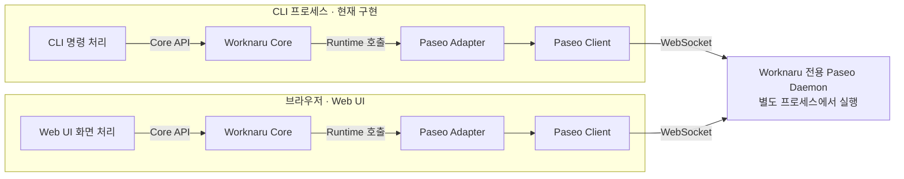

# Worknaru 개념 아키텍처

Worknaru는 누구나 자신의 업무를 AI 기반 Module로 만들고, 그것들을 하나의 Workspace에서 조합·실행할 수 있게 하는 플랫폼이다. 사용자가 플랫폼 안에서 AI Agent와 함께 Module을 개발하는 것이 핵심 목표다.

이 문서는 채택한 제품 계약과 현재 코드의 구성요소·실행 구조를 구분해 설명한다. CLI와 Web UI는 같은 Core·Runtime·Paseo Adapter를 통해 전용 Daemon 상태와 Codex Agent의 생성·대화·대기열·권한·보관을 사용한다. 웹 코드는 브라우저에서 실행하고 지속 대기열은 Daemon의 서버 플러그인이 실행한다.

개별 용어의 정의와 혼동하기 쉬운 차이는 [용어집](glossary.md)에서 확인한다.

제품 호출·로컬 개발 환경 관리·CLI와 브라우저 실행 구조의 현재 결정은 [ADR 0005](adr/0005-local-development-cli-boundary.md)에 둔다. 이전 결정의 본문은 ADR 0001·0003에 보존한다. 작업 범위와 검증 증거는 관련 GitHub Issue에서 관리한다.

## 제품 개념과 현재 구현의 관계

아래는 [ADR 0015](adr/0015-workspace-project-module-contract.md)에서 채택한 계약이다. 이 절의 Workspace·Project는 별도 표기가 없으면 Worknaru의 개념이며, 짧은 정의는 [용어집](glossary.md)을 따른다.

| 범위 | 채택한 제품 계약 | 현재 구현과 후속 범위 |
| --- | --- | --- |
| 업무 구조 | Workspace → Project 소속, 독립 Module의 참조·사용 | Workspace·Project 생성·목록·단건 조회 API, SQLite 저장과 CLI·Web 진입점 구현. 수정·삭제·이동·Module 관리는 후속 범위 |
| Module 실행 | Standalone / Workspace / Project의 명시적 실행 맥락 | 내장 text-stats 실행·Run 저장·CLI/Web 실행·조회 구현. AI 실행·사용자 설치·패키징·버전 배포·취소/재개는 후속 범위 |
| Agent | 직접 대화 및 Module 개발·실행에 참여할 수 있는 실행 대상 | Core는 Agent API와 상태 조회를 제공하며 Agent를 사용하는 Module 실행·Project 연결은 미구현 |
| System Agent | 앱 수준의 안내·작업 진입점 | 전용 기능·cwd·세션·위임 구조는 후속 설계 |

### 업무 구조와 Project 선택

Workspace는 Project를 조직하는 업무 구조의 최상위다. 0개 이상의 Project를 가지며, 각 Project는 정확히 하나의 Workspace에 속한다. 초기 모델에는 Workspace·Project 중첩과 Project의 무소속·동시 다중 소속을 두지 않는다. 이 관계는 앱 수준 Agent나 단독 Module 실행의 선행 조건이 아니다.

Project는 같은 목표나 관리 대상의 자료·대화·결과·결정을 함께 관리하고 후속 작업에서 다시 사용할 필요가 있을 때 만든다. 이미 이력이 쌓여 있어야 하는 것은 아니며, 기간·실행 횟수·기록의 존재만으로 구분하지 않는다. 단독 Run도 기록·결과를 보관한다. 빈 Workspace와 Module을 사용하지 않는 Project도 존재할 수 있다.

첫 Project를 만들 때 Workspace가 없다면 같은 안내 흐름에서 소속 공간과 새 업무를 식별할 수 있게 제안한다. 사용자가 선택·지시한 대상을 사용하며 숨은 Workspace나 임의의 기본 Project를 만들지 않는다. 단일 소속은 자료·기록을 찾을 위치를 명확히 하지만 첫 Project에도 공간을 정해야 하는 부담이 있다.

### Module 사용과 설정

| 관계 | 의미 |
| --- | --- |
| Workspace ↔ Module | 여러 공간에서 기능을 재사용하는 N:M 사용 관계다. 공간에서 자주 사용할 기능을 노출하고 필요한 공통 설정·연결을 구성한다. |
| Project ↔ Module | 여러 업무에서 기능을 재사용하는 N:M 사용 관계다. 해당 Project의 목적·선택 자료·결과에 맞춰 기능을 사용하며 업무별 설정·연결을 둘 수 있다. |

Module 추가·고정은 기능 정의의 소유권 이전이나 코드 복제가 아니다. 목록 구성, 실행, 실행 권한은 서로 다르다. 실행 전에 목록에 반드시 추가할 필요는 없지만 기능의 사용 가능 여부·지원 맥락·필수 입력·파일 및 서비스 접근 조건은 충족해야 한다.

공통 설정을 구성했다는 사실만으로 Project에 자동 적용·상속하지 않는다. 실행에서 실제 적용할 값과 범위를 식별하며 Project 설정을 Workspace에 자동 반영하지도 않는다. 예를 들어 Workspace에 구성한 보고서 템플릿을 Project 실행에서 명시적으로 선택할 수 있지만, 그 선택만으로 Workspace의 지속 상태까지 공유하지 않는다. 일반적인 상속·동기화 규칙은 후속 설계다.

### Module 실행 맥락

Module Execution Context는 업무 대상과 기록·결과의 논리적 귀속이다. 아래 표는 도메인 불변식이며 실제 API 타입은 [Runtime Module 계약](../packages/runtime/README.md#module-실행)이 소유한다.

| 실행 맥락 | 지정할 대상 | Workspace | Project | 기록·결과 귀속 |
| --- | --- | --- | --- | --- |
| Standalone | 단독 실행 | 없음 | 없음 | 사용자에게 다시 조회 가능한 앱 수준 실행 기록·결과 |
| Workspace | Workspace W | W | 없음 | 선택한 W의 해당 실행 |
| Project | Project P | P의 소속에서 도출 | P | 선택한 P의 해당 실행 |

Project 실행은 Project를 기준으로 Workspace를 결정하며 두 값을 독립적인 선택값으로 취급하지 않는다. 외부 요청·참조에 둘 다 포함된 경우에도 P의 소속이 W2인데 W1을 제시한 조합은 거부한다. 마지막으로 열었던 공간이나 현재 프로세스 cwd를 조용히 실행 대상으로 선택하지 않는다.

각 Module은 지원하는 실행 맥락을 제한할 수 있다. Project 자료 관리처럼 Project가 필수인 기능은 무맥락 요청을 거부한다. Module의 독립성은 모든 기능이 세 맥락을 모두 지원하거나 Worknaru·외부 서비스 없이 실행된다는 뜻이 아니다. Standalone 기록을 보관하려고 숨은 Workspace·임시 Project를 만들지 않으며, 앱 수준 보관은 브라우저 저장이나 새 전역 DB를 확정하는 말이 아니다.

### 설정·지속 상태·결과와 수명

Module 정의는 기능의 구현·버전이며 여러 곳에서 재사용한다. 사용 설정은 적용할 선택값, 지속 상태는 다음 실행까지 이어지는 업무 데이터, Run 기록·결과는 개별 실행의 입력·처리 이력·산출물이다. 이는 의미 구분이며 각각을 새 DB 엔티티로 만들라는 요구가 아니다.

같은 Module을 두 Project가 사용해도 입력·설정·지속 상태·결과를 암묵적으로 섞지 않는다. 같은 Project에서 고객용·내부용 보고서를 만들 때에는 실행별 입력·템플릿만 달리할 수도 있다. 설정값의 차이만으로 저장된 복수 프리셋이나 독립된 지속 상태를 요구하지 않는다. 결과의 덮어쓰기나 자료·상태 공유에는 명시적인 선택·정책이 필요하다.

| 동작 | 수명·보존 원칙 |
| --- | --- |
| Module 사용 해제 | 해당 사용 관계를 정리한다. 공유 정의·기존 기록·결과를 자동 삭제하지 않으며 저장 설정·지속 상태의 처분은 별도로 명시한다. |
| Project 삭제 | Project의 관리 데이터 처분 범위를 명시한다. 공유 Module·다른 Project·참조 외부 파일·원래 Agent 이력을 자동 삭제하지 않는다. |
| Workspace 삭제 | Project가 남아 있으면 기본 거부하고 소속 Project 처리를 먼저 명시한다. Workspace 자체의 설정·지속 상태·기록·결과 처분도 구분한다. |
| Module 전역 제거·업데이트 | 영향받는 사용처·실행·설정·상태를 확인한다. 기존 결과의 자동 삭제를 허용하지 않으며 버전 변환·실행 중 충돌 처리는 후속 설계다. |
| 화면 닫기·공간 전환 | 탐색 변경만으로 실행을 종료하거나 저장된 데이터를 삭제하지 않는다. 임시 UI 상태의 수명은 해당 UI 계약을 따른다. |

Module을 개발하는 Project에는 개발 자료·소스·결정을 모을 수 있지만, 완성된 Module은 그 Project의 영구 하위 소유물이 아니다. 개발 Project 삭제가 배포된 Module 삭제를 뜻하지 않으며 실제 배포·패키징·버전 연결은 후속 구현에서 정한다.

### Agent와 리소스의 경계

Agent와 직접 대화하는 데 Module·Project·Workspace 생성을 요구하지 않는다. Agent는 Module 개발을 돕거나 실행에 참여할 수 있으며 필요한 맥락·권한은 역할과 실행마다 다를 수 있다. Module은 Agent 사용·전용 화면·한 번의 함수 호출·일회성 완료를 필수 조건으로 하지 않고, 서비스 처리와 사용자의 검수·수정을 포함할 수 있다.

System Agent는 앱 수준에서 간단한 업무를 단독 실행으로 안내하고 맥락을 축적할 필요가 있을 때 Project를 제안한다. 제품 상태 변경은 제공된 Worknaru API·도구로 수행하며 앱 수준 역할을 모든 업무 자료에 대한 접근 권한으로 해석하지 않는다. 해당 도메인의 생성·실행 기능은 API가 구현된 뒤 제공할 수 있다.

대화 중 Project를 만들거나 선택해도 전체 Agent 이력이 자동 편입되지 않는다. 사용자가 선택한 요약·결과를 Project에 연결해 다시 찾도록 하며 원래 대화의 소속 변경·전체 이력 복제를 전제하지 않는다. Project에 남길 자료와 Agent의 다음 실행에 제공할 맥락은 별도로 식별한다. 현재 요청·이력은 Agent 기준이며 이 연결의 복사·참조·세션·API는 후속 설계다.

Workspace·Project는 로컬 디렉터리·Git 저장소·Agent cwd와 다르다. 한 Project가 여러 자료 위치를 참조할 수 있고 Module에 따라 로컬 파일 시스템이 필요 없을 수도 있다. 파일·폴더·Git 저장소는 연결 가능한 리소스이며 Agent cwd는 실행 PC의 실제 작업 폴더다. 소속을 파일 접근 권한이나 자동 데이터 전달로 해석하지 않는다.

Paseo는 Project 아래에 폴더 기반 Workspace를 두지만 이를 Worknaru의 소속 구조와 이름만으로 동일시하거나 1:1 대응하지 않는다. 기존 저장·초기화 범위와 Agent queue/archive 계약은 유지한다. 현재 데이터 위치·보존 범위는 [데이터 저장 위치](data-storage.md), Web 초기화가 대체한 범위는 [ADR 0012](adr/0012-settings-data-management.md)를 따른다.

### 경계 사례

| 상황 | 적용할 계약 |
| --- | --- |
| PDF를 여러 번 독립적으로 변환 | 맥락을 함께 관리할 필요가 없으면 Standalone 또는 Workspace Run으로 처리한다. 반복 횟수와 기록만으로 Project를 만들지 않는다. |
| 하루 안에 끝나는 보고서의 자료 비교·검토·결정 관리 | 후속 검토에서 맥락을 재사용하므로 짧은 수명의 Project도 적합하다. |
| 첫 Project 생성 | 소속 Workspace를 같은 안내 흐름에서 식별한다. 이미 쌓인 이력을 요구하거나 숨은 공간을 만들지 않는다. |
| 목록에 추가하지 않은 Module 실행 | 목록 구성과 실행을 분리하되 실행에 필요한 준비·입력·권한·맥락 조건을 확인한다. |
| Workspace와 Project 양쪽에 설정 존재 | 실행 대상과 적용값·상태 범위를 식별한다. 소속만으로 자동 상속하지 않는다. |
| 다른 소속의 Workspace와 Project 조합 | 거부한다. Project에서 소속을 도출하고 요청을 조용히 보정하지 않는다. |
| Project가 필수인 Module의 Standalone 요청 | 거부하며 Project를 임의 생성·선택하지 않는다. |
| 대화 결과를 Project에서 다시 찾기 | 선택한 요약·결과만 연결한다. 원래 Agent 이력과 다음 실행 맥락을 구분한다. |
| 개발 Project 삭제 | 개발 자료의 처분과 배포된 Module 수명을 구분한다. |

## 구성과 연결

아래는 CLI와 Web UI의 상태 조회 구조다. 두 앱은 같은 라이브러리 코드를 사용하고, 각각의 실행 환경 안에서 Core·Adapter·Paseo Client 인스턴스를 만든다.

화살표는 호출·통신 흐름이다. **Runtime은 Core와 Adapter 사이의 계약이다. 별도 서버나 추가 실행 단계가 아니다.** Core가 주입받은 Runtime의 메서드를 호출하면 현재 구성에서는 Paseo Adapter의 구현이 실행된다.

Core API는 앱 안에서 호출하는 TypeScript 라이브러리 API다. CLI에서는 CLI 프로세스 안에서, Web UI에서는 브라우저 안에서 실행한다. Paseo Client도 Adapter가 사용하는 라이브러리이며 같은 환경 안에서 동작한다. 실제 통신 대상인 Paseo Daemon은 별도 프로세스로 실행된다.

여기서 공유하는 것은 Core·Runtime·Adapter의 코드와 계약이다. CLI와 Web UI가 하나의 Core 인스턴스나 메모리를 함께 쓰는 것은 아니다. 각 앱은 자신의 연결을 만들고 같은 Daemon을 대상으로 동작할 수 있다. Workspace·Project는 서버의 `worknaru-domain.sqlite`에 보관하며 CLI·Web이 Core의 `workspace`를 통해 같은 전용 RPC를 사용한다. Module Run은 `module-runs.sqlite`에 저장하며 CLI·Web이 Core의 `modules`를 통해 실행·조회한다.

## 구성요소의 책임

| 구성요소 | 책임과 구현 범위 | 코드·사용 안내 |
| --- | --- | --- |
| CLI | 명령·대화형 입력·JSON, 개발 환경 관리, Core를 통한 Agent 작업과 상태 조회 | [apps/cli](../apps/cli/README.md) |
| Web UI | Agent 목록·대화·권한·설정·보관 화면과 Core API 호출 | [apps/web](../apps/web/README.md) |
| Agent service | Daemon 서버 플러그인의 Agent·Workspace RPC, 수명·SQLite·작업 폴더 검증. Core 정책과 Adapter Driver 구성 | [apps/agent-service](../apps/agent-service/README.md) |
| Dev environment | 개발 실행기들이 공유하는 경로·설정·Paseo 프로세스·공개 웹 파일 준비. Node 전용 | [packages/dev-environment](../packages/dev-environment/README.md) |
| Branding | 빌드 시 검증·고정한 제품 표시 이름·정적 자산·색상·링크를 앱에 제공 | [packages/branding](../packages/branding/README.md) |
| Core | 앱의 Worknaru API, Agent 운영 정책과 Workspace·Project 생성·조회·소속 검증. 저장소와 Driver는 실행 앱에서 주입 | [packages/core](../packages/core/README.md) |
| Runtime | 실행 기반에 요청할 기능과 Worknaru가 이해할 결과·오류 타입 정의 | [packages/runtime](../packages/runtime/README.md) |
| Paseo Adapter | 대상·버전 확인, Worknaru RPC 연결, 서버 실행 Driver의 SDK 호출·응답·이벤트 변환 | [packages/paseo-adapter](../packages/paseo-adapter/README.md) |
| Paseo Client | Adapter 내부에서 사용하는 Paseo SDK. Daemon 연결과 메시지 송수신 처리 | [Paseo SDK 안내](https://paseo.sh/docs/sdk.md) |
| Paseo Daemon | 상태·WebSocket·플러그인 호스팅·Codex Agent 실행·세션과 기록 관리 | [전용 개발 환경](../apps/paseo-dev/README.md) |

Core는 구체적인 Paseo SDK, CLI 출력 형식이나 웹 화면을 알지 못한다. 앱의 Core API는 Runtime을 통해 요청하고, 서버 플러그인에서 사용하는 Core 정책은 주입된 Driver·저장소로 Agent 운영을 처리한다. Workspace·Project의 생성·조회 정책은 `createWorkspaceDomain({ store })`, 내장 Module의 실행 정책은 `createModuleService`가 처리한다. Workspace·Project 수정·삭제는 후속 범위다.

Paseo SDK 호출, SDK 고유의 응답·예외 처리와 버전별 대응은 제품 코드에서 Adapter 내부에 모은다. 다른 실행 기반을 도입할 때도 Core가 사용하는 Runtime 계약을 기준으로 연결할 수 있다.

## 앱 시작과 기능 호출

앱의 표시 계층은 [공통 브랜드 패키지](../packages/branding/README.md)가 빌드 시 생성한 이름·자산·색상·링크를 사용한다. Core·Runtime·Adapter는 브랜드에 의존하지 않는다. 저장 위치는 개발 실행기의 [공통 경로 해석](../packages/dev-environment/paths.mjs)이 시작 시 결정하며, 브랜드에서 데이터 경로·서버 ID를 유도하지 않는다. 근거는 [ADR 0004](adr/0004-build-time-branding-and-data-root.md)에 둔다.

초기 입력 계약은 표시 이름의 한글·일반 공백을 허용하되 이미지 파일명은 고정하고 링크 입력은 ASCII로 제한한다. 데이터 루트의 폴더명은 영문·숫자·`-_.`만 받으며 기본 경로도 검증한다. 상세 규칙과 대체 루트 안내는 [저장 위치 설정](../apps/paseo-dev/README.md#저장-위치-설정)을 따른다. 이 검증은 표시·개발 실행 계층이 맡으며 외부 프로젝트나 사용자 홈 전체의 경로 호환성을 보장하지 않는다.

[CLI 시작 코드](../apps/cli/src/bootstrap.ts)는 설정으로 Paseo Adapter를 만들고, 그 Runtime을 Core에 주입한다. 이 단계에서 사용할 구현을 선택한다.

제품 조회의 [명령 처리 코드](../apps/cli/src/cli.ts)는 Core API만 호출한다. 시작 코드가 Adapter의 생성 함수를 가져오는 것과 명령이 실행 기반의 기능을 직접 호출하는 것은 역할이 다르다. 실제 Daemon 작업은 Core와 Runtime 계약을 거쳐 Adapter가 수행한다.

CLI는 사람과 AI Agent가 사용한다. 사람에게는 `doctor`, `dev start`, `status`, `dev stop`의 기본 개발 흐름을 제공하고, 자동화는 명시적 대상과 JSON 계약을 사용할 수 있다. CLI를 호출하는 Agent와 Daemon이 관리하는 Agent 세션은 서로 다른 개념이다. 현재 상태 조회 명령은 호출자를 위한 새 Agent 세션을 만들지 않는다.

Web UI의 [시작 코드](../apps/web/src/bootstrap.ts)도 Adapter를 생성하고 Core에 주입한다. [App](../apps/web/src/shell/App.tsx)은 앱 탐색과 실행 환경별 임시 작업 세션을 소유하고, Agent 기능과 통합 설정이 Core API의 결과·오류를 표시한다. React 화면은 [공통 UI](../packages/ui/README.md)를 조립하고, UI 패키지는 Core·Runtime·Paseo를 호출하지 않는다. 개발 실행기가 대상 ID·예상 서버 ID를 `connection.json`으로 전달하고 브라우저는 같은 호스트의 `/ws`로 접속한다. CLI 환경 변수는 브라우저에서 직접 읽지 않는다. 기본 전송 설정은 CLI와 같은 서버 저장소에 기록하며 테마·패널 선호는 브라우저에만 둔다. 인증 입력·대상 선택은 지원하지 않는다. UI 책임 경계는 [ADR 0009](adr/0009-ui-design-system.md), 화면 이동과 작업 상태의 수명은 [ADR 0010](adr/0010-app-shell-and-work-context.md)을 따른다.

Web UI의 HTML·JavaScript 같은 정적 파일은 Paseo Daemon 자체가 브라우저에 제공할 수 있다. 별도 정적 호스팅을 사용할 수도 있으며, 파일을 제공하는 위치와 Core·Adapter가 실행되는 위치는 구분한다. 어느 경우든 전달된 코드의 Core 호출과 Daemon 통신은 브라우저 안에서 수행하므로 이 경로에 별도 Worknaru API 서버를 필수 구성요소로 두지 않는다.

현재 `pnpm exec worknaru dev start`는 Web UI·Core·Adapter·Paseo Client를 포함한 브라우저용 빌드 결과물을 `apps/web/dist`에 만들고, 공개 자산만 별도 임시 디렉터리에 복사해 전용 Paseo Daemon이 제공하도록 실행한다. 브라우저는 Daemon에서 파일을 받아 실행한 뒤, 그 안의 Client로 같은 Daemon에 WebSocket 연결을 맺는다. 현재 고정한 Paseo 버전은 웹 UI를 활성화한 상태에서 `PASEO_WEB_UI_DIST_DIR` 또는 `features.webUi.distDir`로 제공할 디렉터리를 지정할 수 있다. 개발 명령은 자식 환경에만 전자를 전달해 기존 Daemon 설정 파일을 보존한다. [Daemon 웹 UI 제공 안내](https://paseo.sh/docs/web-ui.md), [디렉터리 설정 소스](https://github.com/getpaseo/paseo/blob/7bcf167862ce9bb040007d1469c77c00928a84c8/packages/server/src/server/config.ts)

정적 파일 제공과 접속 설정 전달은 별개의 책임이다. 현재는 같은 PC의 loopback 주소에서 개발용 화면을 제공한다. 원격 접속·인증과 실제 제품의 호스팅 구성은 후속 배포 설계에서 정한다.

## 상태 조회 한 번의 흐름

상태 조회 명령 `worknaru status`의 동작 순서는 다음과 같다.

1. 연결 옵션·환경 변수가 하나라도 있으면 명시적 주소와 예상 서버 ID를 모두 요구한다. 없으면 현재 데이터 루트의 관리 실행기·서버 ID·PID 기록을 확인하고 해당 대상을 선택한다. 불완전한 명시적 설정은 기본 대상으로 보충하지 않는다.
2. 시작 코드가 Adapter와 Core를 구성하고, 명령 처리 코드가 `Core.getDaemonStatus()`를 호출한다.
3. Core는 주입된 `Runtime.getDaemonStatus()`를 호출한다.
4. Adapter가 조회용 클라이언트로 접속하고 서버 ID와 버전을 확인한다. 확인을 통과하면 Daemon 상태를 요청한다.
5. Adapter가 응답이나 실패를 Worknaru의 `DaemonStatus`로 변환하고 자신의 클라이언트 연결을 정리한다.
6. CLI가 Core에서 받은 결과를 출력하고 종료 코드를 반환한다. 상태가 확인되면 `0`, 조회 불가이면 `1`이다. 입력·설정 오류와 예상하지 못한 오류는 별도로 구분한다.

기본 로컬 조회는 개발 환경 상태와 Core 결과를 별도 `daemon` 필드에 담고, 기존 명시적 조회는 DaemonStatus JSON을 그대로 반환한다. 제품 조회 결과에는 대상, 확인 시각, 연결 상태, 확인된 서버 정보와 실패 이유가 담긴다. 연결 상태는 조회 당시의 관찰값이다. 접속 실패만으로 원격 운영체제의 프로세스가 종료되었다고 판단하지 않으므로, 로컬 프로세스 상태는 `unknown`으로 표현한다.

조회는 Daemon이나 Agent를 시작·중단·보관하지 않는다. 명령이 끝날 때 정리하는 것은 조회용 연결이다. 명령 문법·인증 전달·출력 형식·종료 코드의 상세 정의는 [CLI 사용 안내](../apps/cli/README.md), 결과 타입의 의미는 [Runtime 계약](../packages/runtime/README.md)을 따른다.

Web UI의 상태 조회도 같은 Core API와 Runtime 결과를 사용한다. 입력과 결과 표현을 웹 화면이 맡고, 대상 확인·상태 조회·오류 변환·조회용 연결 정리는 공통 Adapter가 맡는다.

## Workspace·Project 생성과 조회

Core의 `createWorkspaceDomain({ store })`는 생성·목록·단건 조회의 여섯 메서드를 제공한다. Workspace는 `id`, `name`, `createdAt`, Project는 여기에 필수 `workspaceId`를 가진다. ID·생성 시각은 Core가 생성하며 이름 중복을 식별자로 사용하지 않는다. Project 생성·목록 조회는 명시한 Workspace의 존재를 검사하고, 저장소도 외래키로 소속을 강제한다. 세부 입력·오류·예제는 [Core 안내](../packages/core/README.md#workspaceproject-최소-도메인)에 있다.

기존 서버 플러그인이 이 Core API에 Node 전용 SQLite 저장소를 주입하고 별도의 `workspace.execute` RPC를 등록한다. 이는 고정된 여섯 작업의 전송용 envelope이며 임의 메서드 호출은 허용하지 않는다. Agent 초기화·Provider 연결과 별도로 실행하며 새 서버나 포트를 추가하지 않는다. CLI·Web은 `Core.workspace → Runtime.workspace → Adapter`로 호출한다. 공통 타입·오류·API 계약은 Runtime에, 저장 포트와 업무 정책은 Core에 있다. Web의 선택은 URL에 보존하는 탐색 상태이며 Agent 실행 맥락을 변경하지 않는다. 앱 연결의 근거는 [Issue #53](https://github.com/NaruForge/worknaru-dev/issues/53)에 있다.

저장은 [소유권이 확인된 전용 루트](data-storage.md)의 `worknaru-domain.sqlite`를 사용한다. `agent-state.sqlite`와 Paseo의 `projects/`를 변경하지 않는다. 정상 서비스 재시작은 데이터를 보존하고 기존의 승인된 전용 루트 전체 초기화는 이 DB도 제거한다. 소속만으로 Agent·cwd·파일 권한·Module 실행 맥락을 연결하지 않으며 숨은 Workspace나 Project를 만들지 않는다. 변경·검증 근거는 [Issue #51](https://github.com/NaruForge/worknaru-dev/issues/51)에 있다.

## 내장 Module 실행과 Run 기록

CLI는 `Core.modules → Runtime.modules → Adapter`로 기존 서버 플러그인의 `modules.execute`를 호출한다. 서버 앱은 Core의 `createModuleService`에 Workspace 조회, 신뢰된 내장 구현과 SQLite 저장 포트를 주입한다. 첫 구현은 Provider 없이 문자열을 분석하는 `text-stats`다. 명시적인 Standalone/Workspace/Project 대상만 받고 Project에서 Workspace를 도출한다. 업무 맥락이 Agent cwd나 파일 권한을 자동 부여하지 않는다.

Run은 `module-runs.sqlite`에 입력·결과·귀속·Module 버전·시각과 함께 저장한다. 요청 UUID로 중복 접수를 막고 accepted/running 저장 뒤 실행한다. 실행·결과 검증·저장 성공은 succeeded, 실행 예외는 failed, 재시작 시 미완료 기록은 uncertain이다. 정상 종료는 실행 중인 호출을 기다리고 비정상 종료 후 자동 재실행하지 않는다. [ADR 0016](adr/0016-module-run-idempotency-and-recovery.md), [CLI 사용법](../apps/cli/README.md#module-실행과-run-조회), [#55](https://github.com/NaruForge/worknaru-dev/issues/55)에 경계와 근거가 있다.

## Agent 작업과 지속 대기열

CLI/Web의 `Core.agents`의 Agent 전용 메서드 → Runtime → Adapter가 전용 플러그인의 `agents.execute`를 호출한다. 플러그인은 Core 정책에 Node 전용 Paseo Driver·SQLite 저장소·폴더 검증을 주입한다. Provider 실행과 타임라인은 Paseo가 관리하고, 전송 접수·기본 설정·정지 상태는 Worknaru의 SQLite가 관리한다. 이 두 자료를 완료 여부 추정으로 혼합하지 않는다.

Core 정책은 메시지를 먼저 저장하고 Agent별로 직렬 처리한다. 기본 FIFO는 현재 턴이 성공한 뒤 다음 메시지를 실행한다. 권한 대기·실패·취소·결과 불명확에서는 다음 작업을 보류한다. 전송 방식은 공통 설정에서만 선택하고 새 접수부터 적용한다. 추가 지시는 Paseo 기본 steer로 전달하며 미지원 시 기존 작업을 교체할 수 있다. protocol/server 패치와 메시지별 override는 없다. 내부 직렬화는 Worknaru 서비스 경유 요청에 적용하며 외부 Paseo 클라이언트의 같은 Agent 동시 변경까지 원자적으로 조정하지 않는다.

Web은 주기적으로 상태·기록을 조회하고, CLI는 접수만 받거나 결과를 관찰한다. Worker는 Provider 이벤트를 별도 연결로 구독하므로 탭·CLI 종료는 작업 종료가 아니다. Daemon 재시작 뒤 대기 메시지는 남고 미확정 실행은 `uncertain`으로 멈춘다. 사용자가 기록을 확인해 실행 포기 처리한 뒤 남은 대기를 재개할 수 있다. 보관은 하위 Agent와 대기열 영향을 다시 확인하고 실행을 정리하며 대화·파일을 보존한다. 선택 근거와 대안은 [ADR 0008](adr/0008-native-paseo-send-settings.md)에 있다.

## 브라우저 호환 범위

브라우저 호환은 Core·Adapter의 공통 코드를 CLI의 Node.js 환경과 브라우저 양쪽에서 실행할 수 있도록 조정하고 검증하는 작업이다. 웹 화면을 만드는 작업과 구분한다.

Paseo Client는 환경에 맞는 WebSocket 연결 구현을 전달받을 수 있다. Paseo의 [CLI 연결 코드](https://github.com/getpaseo/paseo/blob/7bcf167862ce9bb040007d1469c77c00928a84c8/packages/cli/src/utils/client.ts)는 Node.js용 `ws`를 제공하고, [웹 연결 코드](https://github.com/getpaseo/paseo/blob/7bcf167862ce9bb040007d1469c77c00928a84c8/packages/app/src/runtime/websocket-factory.web.ts)는 브라우저 WebSocket을 사용하는 Client 기본 기능을 선택한다. Worknaru는 이 Client를 Adapter 안에서 재사용한다.

Core·Runtime의 책임과 상태 조회 계약을 유지하면서 다음과 같이 브라우저 실행을 지원한다.

| 부분 | 현재 적용 내용 |
| --- | --- |
| Adapter | 연결 ID는 공통 Web Crypto로 생성하고 표준 WebSocket으로 접속한다. 앱 시작 코드가 `clientType`을 `'cli'` 또는 `'browser'`로 전달한다. |
| 의존 패키지와 빌드 | 버전에 한정한 pnpm 패치로 Paseo relay의 브라우저 파일 경로를 조정한다. 웹 빌드는 Core·Adapter·Client를 함께 포함한다. 세부 사항은 [Adapter 안내](../packages/paseo-adapter/README.md)를 따른다. |
| 검증 경계 | Windows의 브라우저에서 전용 Daemon의 정상 조회·종료 후 실패를 확인한다. 인증 오류·대상 불일치·시간 초과는 loopback 응답 서버로 검증한다. 기존 CLI 동작은 공통 테스트와 전용 Daemon 검증으로 확인한다. |

상태 조회의 설계 조사 근거는 [아키텍처 작업 #7](https://github.com/NaruForge/worknaru-dev/issues/7), 최초 구현·실행 검증은 [웹 상태 조회 #9](https://github.com/NaruForge/worknaru-dev/issues/9), 정식 버전 전환은 [0.8.0 전환 #11](https://github.com/NaruForge/worknaru-dev/issues/11)에 있다. Agent 기능의 CLI/Web 교차 사용·권한·대기열·보관 검증은 [#17](https://github.com/NaruForge/worknaru-dev/issues/17)에 연결한다. 다른 브라우저·원격 배포·로그인 호환성 전체를 보장하는 것은 아니다.

## 실행 환경과 데이터 경계

Worknaru 전용 Paseo는 현재 PC의 개인용 Paseo와 실행 인스턴스, Daemon 데이터 디렉터리와 접속 주소를 분리한다. Adapter는 지정한 대상의 서버 ID를 확인하며, 접속에 실패해도 다른 Paseo로 대체 접속하지 않는다.

같은 Windows 사용자 홈, 파일 접근 권한과 기존 Provider 인증 환경은 함께 사용할 수 있다. 분리의 목적은 두 Daemon의 운영 충돌을 방지하는 것이다.

| 위치·수명 | 현재 보관하는 것 |
| --- | --- |
| Git 저장소 | 소스, 문서, 패키지 의존성과 개발 환경 재현 절차 |
| CLI 프로세스 | 명령·관찰 중인 클라이언트·결과. 종료해도 Agent·대기열을 삭제하지 않음 |
| 브라우저 | 웹 코드·대상 설정·선택된 Agent·화면 결과·입력 중 초안. Agent·대기열의 원본은 Daemon에 있음 |
| 전용 Daemon 데이터 디렉터리 | 식별 정보·설정·로그·Agent 기록·worktree·임시 파일·CLI 관리 기록과 `agent-state.sqlite`의 전송·설정, `worknaru-domain.sqlite`의 Workspace·Project. `WORKNARU_DATA_DIR`로 지정하며 기본값은 저장소 밖의 `%LOCALAPPDATA%\Worknaru-Dev` |
| 임시 웹 제공 디렉터리 | 데이터 루트의 `tmp/web-*`. 공개 빌드 자산과 실행용 `connection.json`만 제공하고 해당 실행 종료 시 정리 |
| 기존 사용자 환경 | 공유하여 사용할 수 있는 Provider 설정과 인증 정보 |

데이터별 경로·폴더 구조·종료와 초기화 시 보존 범위는 [데이터 저장 위치](data-storage.md)에서 확인한다. 버전·접속 주소·저장 루트 입력 규칙과 실행 절차는 [Paseo 개발 환경 안내](../apps/paseo-dev/README.md)에서 관리한다. Git 커밋이나 태그로 보존하는 코드와 Daemon의 실행 데이터는 보존 범위가 다르다.

브라우저는 화면과 클라이언트 연결을 담당하고 Provider 실행·파일 접근·Agent 세션 관리는 접속 대상 Daemon에서 이루어진다. 작업 폴더는 Daemon 파일 시스템 기준이다. 탭·연결 종료는 Agent 작업을 종료하지 않으며 `dev stop`은 전용 실행 환경 전체를 종료한다.

## 로컬 개발 환경 관리

`doctor`, `dev start`, `dev stop`, `dev reset`과 기본 대상 선택은 CLI 앱 계층의 책임이다. Web 설정의 데이터 관리도 같은 실행기에 위임한다. Web 앱의 개발 관리 클라이언트 → 기존 Daemon의 `development.data` RPC → 서버 플러그인의 소유권 확인 → 기존 named pipe → CLI 실행기 순서다. 별도 관리 서버나 포트를 추가하지 않는다. [ADR 0012](adr/0012-settings-data-management.md) Core와 Runtime에 파일·프로세스 관리 API를 추가하지 않는다. 실제 Daemon 상태 조회는 기본 대상에서도 Core → Runtime → Adapter를 거친다.

빌드 없이 읽을 수 있는 [진입점](../apps/cli/entry.mjs)이 진단·로컬 관리와 제품 조회를 분기한다. [공통 개발 라이브러리](../packages/dev-environment/README.md)는 기존 검증 앱과 CLI가 같은 경로·설정·실행·웹 파일 준비를 사용하게 한다. CLI가 검증 앱에 의존하지 않으므로 검증 앱 → CLI 의존성과 순환하지 않는다.

시작 명령은 데이터 루트의 작업 잠금과 저장소의 빌드 잠금을 사용한다. 정상 실행 중이면 재사용하고, 정지 상태에서만 빌드 후 숨겨진 detached 실행기를 시작한다. 실행기는 자신이 만든 Daemon 자식 핸들을 보유하며, 최초 CLI와는 Node IPC로 준비 완료를 주고받는다. 이후 CLI는 실행 기록의 임의 토큰과 Windows named pipe를 통해 같은 실행기에 연결한다. 기록의 저장소·데이터 루트와 응답의 소유권, 서버 ID·PID 기록을 대조한다. 웹 자산과 접속 설정, Core 응답까지 준비돼야 성공한다.

종료 명령은 이 실행기에 정상 종료를 요청한다. 저장된 PID만으로 프로세스를 종료하거나 불명확한 기록을 자동 삭제하지 않는다. 제한 시간·실패 정리·수동 확인 방법과 제외 범위는 [CLI 안내](../apps/cli/README.md)를 따른다. 이 제어 채널은 Windows 로컬 개발 실행기 내부용이며 제품 HTTP API가 아니다. Web에서 받은 제한된 개발 데이터 관리 요청을 같은 채널로 전달한다.

저장 루트의 `worknaru-data.json`은 사용자 DB를 열지 않고 제품·소유 checkout·저장 구조 버전·초기화 상태를 확인한다. 구조 변경은 `reset_required`로 중단하며 마이그레이션하지 않는다. 명시적 전체 초기화는 전용 데이터만 지우고 실제 프로젝트·소스·개인 로그인 정보를 보존한다. 실패 시 `resetting`을 남겨 재시도 전 실행을 막는다. 새 checkout은 기존 루트를 재사용하지 않는다. [ADR 0011](adr/0011-external-data-and-development-reset.md)

Agent의 작업 폴더는 호출자가 명시하고 서버 경계에서 실제 경로를 검증한다. 생성·모델 조회·새 전송·dispatch·재개·권한 승인 시 검증하며 공통 Core에는 파일 시스템 구현을 주입한다. Web은 유효한 작업 폴더를 입력한 후 모델을 조회한다. CLI 초기화 후 Web은 수동 새로고침으로 새 server ID를 적용한다. Web에서 초기화를 요청한 탭은 요청 ID와 새 서버의 준비 완료를 확인한 후 새로고침하고 UI 선호·선택·임시 상태를 새로 시작한다.

## 개발 검증 도구의 위치

[apps/paseo-dev](../apps/paseo-dev/README.md)는 개발자가 전용 Daemon과 제품 코드의 연결을 확인하는 검증 프로그램이다. `pnpm paseo:verify`는 자신이 시작한 전용 Daemon을 대상으로 SDK·Adapter·실제 Worknaru CLI를 확인하고, 마지막에 그 Daemon을 종료한다.

이 도구는 비교 기준을 얻고 테스트 환경을 제어하기 위해 SDK와 Daemon 시작·종료 기능을 직접 사용한다. 제품 사용자의 상태 조회 경로는 위의 CLI → Core → Adapter 흐름을 따른다. `pnpm paseo:status`는 Adapter를 직접 확인하는 개발용 조회 명령이다.

`pnpm web:dev`는 같은 전용 환경에서 웹 파일 제공를 켜고 수동 테스트가 끝날 때까지 실행을 유지한다. 브라우저의 상태 조회는 Web UI → Core → Adapter 흐름을 따른다. 두 개발 명령의 Daemon 생성·소유권 확인·정리는 [공통 실행 코드](../packages/dev-environment/daemon.mjs)에 모은다.

`pnpm dev:verify`는 격리된 복사본에서 최초 빌드·백그라운드 수명·반복/동시 명령·실패 정리·기본/지정 데이터 루트 보존을 실제 Daemon으로 검사한다. 관리형 실행 검증은 [Issue #15](https://github.com/NaruForge/worknaru-dev/issues/15)에 둔다.

검증 코드는 [CLI 테스트](../apps/cli/test/cli.test.mjs), [Adapter 테스트](../packages/paseo-adapter/test/status.test.mjs), [실제 Daemon 연동 검증](../apps/paseo-dev/verify.mjs)에 있다. 검증 증거는 [전용 환경 #1](https://github.com/NaruForge/worknaru-dev/issues/1), [Runtime·Adapter #2](https://github.com/NaruForge/worknaru-dev/issues/2), [Core·CLI #4](https://github.com/NaruForge/worknaru-dev/issues/4)에 연결한다.

## 이후 설계에서 이어갈 부분

제품 기능을 늘릴 때는 필요한 Core API와 Runtime 기능을 정하고, 실행 기반의 호출을 Adapter에서 연결한다. 업무 구조와 Module 실행 맥락은 위 제품 계약을 따른다. Workspace·Project의 수정·삭제·이동 API, AI 기반 Module 실행·사용자 설치·취소/재개·Web 진입점, 패키징·배포·버전, 일반적인 설정 상속·동기화, 공유 상태, Project 이동·공유, System Agent의 세션·위임과 권한의 구체 모델은 후속 설계다. 초기 지원 기능에 대한 검토 내용은 [Paseo Adapter 설계 초안](paseo-adapter-initial-design.md)에 있으며, 그 제안과 실제 구현은 구분해서 읽는다.

패키지를 추가하거나 이동할 때는 [저장소 구조 규칙](repository-structure.md)을 따른다. 이 문서는 구성요소와 흐름을 설명하고, 중요한 결정의 근거는 ADR에 남긴다.
