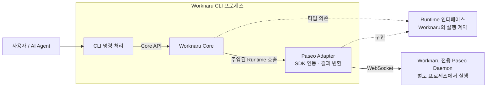

# Worknaru 개념 아키텍처

Worknaru는 누구나 자신의 업무를 AI 기반 Module로 만들고, 그것들을 하나의 Workspace에서 조합·실행할 수 있게 하는 플랫폼이다. 사용자가 플랫폼 안에서 AI Agent와 함께 Module을 개발하는 것이 핵심 목표다.

이 문서는 함께 버전 관리되는 코드의 구조를 설명한다. 현재 구현은 전용 CLI에서 실행 기반의 상태를 확인하는 첫 기능이며, 그 경로를 중심으로 구성요소와 책임을 정리한다. 장기적인 의존 경계의 결정 근거는 [ADR 0001](adr/0001-runtime-interface-and-paseo-adapter.md), 작업 범위와 검증 증거는 관련 GitHub Issue에서 관리한다.

## 제품 개념과 현재 구현의 관계

| 개념 | 플랫폼에서의 의미 |
| --- | --- |
| Module | 하나의 업무 기능. 외부 서비스, 로컬 서비스, AI Agent의 참여와 사용자의 검수·수정을 함께 구성할 수 있다. |
| Workspace | 사용자가 자신의 업무에 필요한 Module들을 모아 조합하고 실행하는 공간이다. |
| AI Agent | 사용자와 함께 Module 개발을 돕거나, Module이 실행되는 과정에 참여하는 역할이다. 두 역할은 필요로 하는 맥락과 권한이 다를 수 있다. |

예를 들어 문서 정규화 Module은 업로드된 형식에 따라 변환 서비스를 선택하고, 변환 결과를 사람이 검수·수정한 뒤 일관된 최종 문서를 만들 수 있다. 이는 플랫폼이 지원하려는 업무의 예시다.

현재 코드가 제공하는 것은 이 제품을 만들기 위한 실행 기반의 연결과 상태 조회다. Module 정의·개발·실행, Worknaru Workspace 관리와 Agent 세션의 생성·재사용은 아직 제품 API로 구현하지 않았다. Worknaru Workspace와 Paseo Workspace의 대응 관계도 후속 설계 대상이다.

## 구성과 연결

실선은 호출·통신 흐름이고 점선은 인터페이스에 대한 의존·구현 관계다. **Runtime은 Core와 Adapter 사이의 계약이다. 별도 서버나 추가 실행 단계가 아니다.** Core가 주입받은 Runtime의 메서드를 호출하면 현재 구성에서는 Paseo Adapter의 구현이 실행된다.

CLI, Core와 Adapter는 하나의 CLI 프로세스 안에서 동작한다. 현재 Core API는 TypeScript 라이브러리 API이며 HTTP 서버가 아니다. Paseo Daemon은 CLI와 독립적으로 살아 있는 실행 서비스다.

## 구성요소의 책임

| 구성요소 | 현재 책임 | 코드·사용 안내 |
| --- | --- | --- |
| CLI | 명령·옵션·환경 변수 해석, Core API 호출, 일반 텍스트·JSON 출력과 종료 코드 결정 | [apps/cli](../apps/cli/README.md) |
| Core | 앱이 호출할 Worknaru API 제공. 현재 `getDaemonStatus()`를 주입된 Runtime으로 전달 | [packages/core](../packages/core/README.md) |
| Runtime | 실행 기반에 요청할 기능과 Worknaru가 이해할 결과·오류 타입 정의 | [packages/runtime](../packages/runtime/README.md) |
| Paseo Adapter | 지정한 Daemon에 접속해 식별자·버전·상태를 확인하고, SDK 응답·오류를 Runtime 계약으로 변환 | [packages/paseo-adapter](../packages/paseo-adapter/README.md) |
| Paseo Daemon | 접속을 받아 상태를 제공하는 실행 서비스. Paseo가 가진 Agent 실행·세션 관리 기능은 이후 필요한 범위에서 연결 | [전용 개발 환경](../apps/paseo-dev/README.md) |

Core는 구체적인 Paseo SDK나 CLI 출력 형식을 알지 못한다. 현재 Core는 상태 조회를 전달하는 얇은 API다. Module·Workspace의 업무 정책과 관계를 담당할 경계는 Core에 두며, 해당 업무 로직은 별도 구현 범위로 남아 있다.

Paseo SDK 호출, SDK 고유의 응답·예외 처리와 버전별 대응은 제품 코드에서 Adapter 내부에 모은다. 다른 실행 기반을 도입할 때도 Core가 사용하는 Runtime 계약을 기준으로 연결할 수 있다.

## CLI 시작과 명령 처리

[CLI 시작 코드](../apps/cli/src/bootstrap.ts)는 설정으로 Paseo Adapter를 만들고, 그 Runtime을 Core에 주입한다. 이 단계에서 사용할 구현을 선택한다.

그 뒤 [명령 처리 코드](../apps/cli/src/cli.ts)는 Core API만 호출한다. 시작 코드가 Adapter의 생성 함수를 가져오는 것과 명령이 실행 기반의 기능을 직접 호출하는 것은 역할이 다르다. 실제 Daemon 작업은 Core와 Runtime 계약을 거쳐 Adapter가 수행한다.

CLI의 주 사용자는 AI Agent이며 사람이 직접 실행할 수도 있다. CLI를 호출하는 Agent와 Daemon이 관리하는 Agent 세션은 서로 다른 개념이다. 현재 상태 조회 명령은 호출자를 위한 새 Agent 세션을 만들지 않는다.

## 상태 조회 한 번의 흐름

현재 제품 명령은 `worknaru status`다. 동작 순서는 다음과 같다.

1. CLI가 명시적인 접속 주소와 예상 서버 ID를 옵션 또는 `WORKNARU_*` 환경 변수에서 읽는다. 설정이 없으면 오류를 반환한다.
2. 시작 코드가 Adapter와 Core를 구성하고, 명령 처리 코드가 `Core.getDaemonStatus()`를 호출한다.
3. Core는 주입된 `Runtime.getDaemonStatus()`를 호출한다.
4. Adapter가 조회용 클라이언트로 접속하고 서버 ID와 버전을 확인한다. 확인을 통과하면 Daemon 상태를 요청한다.
5. Adapter가 응답이나 실패를 Worknaru의 `DaemonStatus`로 변환하고 자신의 클라이언트 연결을 정리한다.
6. CLI가 Core에서 받은 결과를 출력하고 종료 코드를 반환한다. 상태가 확인되면 `0`, 조회 불가이면 `1`이다. 입력·설정 오류와 예상하지 못한 오류는 별도로 구분한다.

조회 결과에는 대상, 확인 시각, 연결 상태, 확인된 서버 정보와 실패 이유가 담긴다. 연결 상태는 조회 당시의 관찰값이다. 접속 실패만으로 원격 운영체제의 프로세스가 종료되었다고 판단하지 않으므로, 로컬 프로세스 상태는 `unknown`으로 표현한다.

조회는 Daemon이나 Agent를 시작·중단·보관하지 않는다. 명령이 끝날 때 정리하는 것은 조회용 연결이다. 명령 문법·인증 전달·출력 형식·종료 코드의 상세 정의는 [CLI 사용 안내](../apps/cli/README.md), 결과 타입의 의미는 [Runtime 계약](../packages/runtime/README.md)을 따른다.

## 실행 환경과 데이터 경계

Worknaru 전용 Paseo는 현재 PC의 개인용 Paseo와 실행 인스턴스, Daemon 데이터 디렉터리와 접속 주소를 분리한다. Adapter는 지정한 대상의 서버 ID를 확인하며, 접속에 실패해도 다른 Paseo로 대체 접속하지 않는다.

같은 Windows 사용자 홈, 파일 접근 권한과 기존 Provider 인증 환경은 함께 사용할 수 있다. 분리의 목적은 두 Daemon의 운영 충돌을 방지하는 것이다.

| 위치·수명 | 현재 보관하는 것 |
| --- | --- |
| Git 저장소 | 소스, 문서, 패키지 의존성과 개발 환경 재현 절차 |
| CLI 프로세스 | 호출에 전달된 설정과 조회 중인 클라이언트·결과. Core와 Adapter에 별도 업무 상태 저장소는 없음 |
| 전용 Daemon 데이터 디렉터리 | Daemon 식별 정보, 설정·로그 등 실행 데이터. 개발 환경의 `.local/` 아래에 두며 Git 추적에서 제외 |
| 기존 사용자 환경 | 공유하여 사용할 수 있는 Provider 설정과 인증 정보 |

구체적인 경로·버전·접속 주소와 실행 절차는 [Paseo 개발 환경 안내](../apps/paseo-dev/README.md)에서 관리한다. Git 커밋이나 태그로 보존하는 코드와 Daemon의 실행 데이터는 보존 범위가 다르다.

## 개발 검증 도구의 위치

[apps/paseo-dev](../apps/paseo-dev/README.md)는 개발자가 전용 Daemon과 제품 코드의 연결을 확인하는 검증 프로그램이다. `pnpm paseo:verify`는 자신이 시작한 전용 Daemon을 대상으로 SDK·Adapter·실제 Worknaru CLI를 확인하고, 마지막에 그 Daemon을 종료한다.

이 도구는 비교 기준을 얻고 테스트 환경을 제어하기 위해 SDK와 Daemon 시작·종료 기능을 직접 사용한다. 제품 사용자의 상태 조회 경로는 위의 CLI → Core → Adapter 흐름을 따른다. `pnpm paseo:status`는 Adapter를 직접 확인하는 개발용 조회 명령이다.

검증 코드는 [CLI 테스트](../apps/cli/test/cli.test.mjs), [Adapter 테스트](../packages/paseo-adapter/test/status.test.mjs), [실제 Daemon 연동 검증](../apps/paseo-dev/verify.mjs)에 있다. 검증 증거는 [전용 환경 #1](https://github.com/NaruForge/worknaru-dev/issues/1), [Runtime·Adapter #2](https://github.com/NaruForge/worknaru-dev/issues/2), [Core·CLI #4](https://github.com/NaruForge/worknaru-dev/issues/4)에 연결한다.

## 이후 설계에서 이어갈 부분

제품 기능을 늘릴 때는 필요한 Core API와 Runtime 기능을 정하고, 실행 기반의 호출을 Adapter에서 연결한다. 현재 문서는 앞으로의 세션 정책, Module 실행 모델이나 Workspace 저장 구조를 확정하지 않는다. 초기 지원 기능에 대한 검토 내용은 [Paseo Adapter 설계 초안](paseo-adapter-initial-design.md)에 있으며, 그 제안과 실제 구현은 구분해서 읽는다.

패키지를 추가하거나 이동할 때는 [저장소 구조 규칙](repository-structure.md)을 따른다. 이 문서는 구성요소와 흐름을 설명하고, 중요한 결정의 근거는 ADR에 남긴다.
